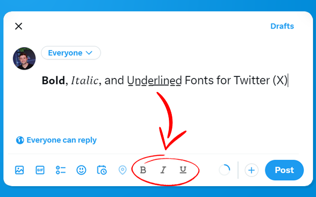
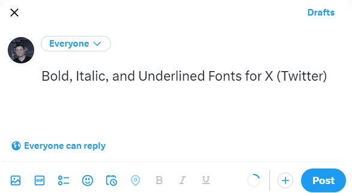

<!-- omit in toc -->
# Twitter (X) Font Editor

 
 

Use **𝗕𝗼𝗹𝗱**, *𝐼𝑡𝑎𝑙𝑖𝑐*, and <ins>Underlined</ins> Font to make your Twitter (X) Posts stand out🔥

"Twitter (X) Font Editor" is a Chrome Browser Extension that allows you to use unicode characters in 
your Twitter (X) posts to make text **𝗕𝗼𝗹𝗱**, *𝐼𝑡𝑎𝑙𝑖𝑐*, and <ins>Underlined</ins>.

👉 Get it here [for Chrome](https://chromewebstore.google.com/detail/x-twitter-post-text-edito/dgcfmccdeggjhkpndikcanaobhkggffd) 

Made by [maxontech](https://twitter.com/max_on_tech)

<!-- omit in toc -->
## Table of contents

- [Features](#features)
- [Opening the Extension](#opening-the-extension)
- [Installing locally on Chrome](#installing-locally-on-chrome)
- [Libraries](#libraries)
- [Contact](#contact)

## Features

When you make a new Twitter (X) post, you'll see three icons (**B**, *I*, <ins>U</ins>) at the top of the text field.
Simply highlight the text you want to chage and click on the corresponding edit button.

  

## Opening the Extension

Simply install the extension. It's enabled by default whenever you create a new post.

## Installing locally on Chrome
You can run the extension locally without having to install it from the Chrome Store.

1. Download the code. In the web version of GitHub, you can do that by clicking the green "Code" button, and then "Download ZIP".
2. Go to chrome://extensions/ in your browser, and [enable developer mode](https://developer.chrome.com/docs/extensions/mv2/faq/#:~:text=You%20can%20start%20by%20turning,a%20packaged%20extension%2C%20and%20more.).
3. Drag the [main folder](https://github.com/maxontech/twitter-font-editor/tree/master/main) (make sure it's a folder and not a ZIP file, so unzip first), or click on the "Load unpacked" button and locate the folder.
4. That's it, you will now be able to use the extension locally.

## Libraries

- [jQuery](https://jquery.com/) - for better event handling and DOM manipulation

## Contact

Feel free to reach out to me [on Twitter](https://twitter.com/max_on_tech) if you have any questions or feedback! Hope you find this useful!
